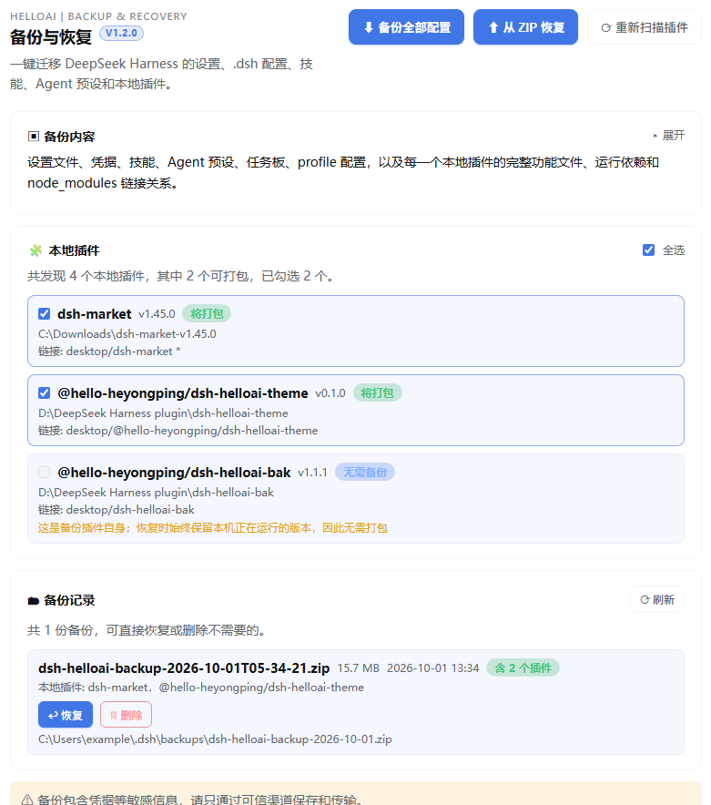
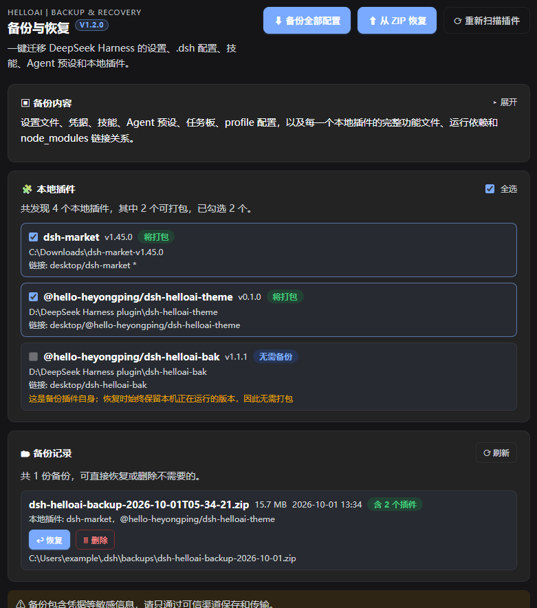

# HelloAI Backup & Restore · DeepSeek Harness 备份与恢复插件

[](LICENSE)


**一键把整个 DeepSeek Harness 打包带走。** 在设置里加 **备份** 和 **恢复** 两个按钮，把设置、`.dsh` 配置、技能、Agent 预设、任务板、profile 配置和**本地插件**一起打成 ZIP，换电脑时还原回原来的目录。

重点是**插件**：手工链接的、没写进 `package.json` 的本地插件也一样被找出来、打得进去、还原得回来——这是同类备份工具最常漏掉的一块。



*设置 → 备份与恢复：上面是「本地插件」清单（哪些要打包由你勾选），下面是「备份记录」，每条都能直接恢复或删除。*

<details>
<summary>点击看深色主题下同一面板</summary>



</details>

## 它能做什么

- **发现本地插件**：不只读 profile `package.json` 里的 `link:` / `file:` 依赖，还会扫描每个 profile 的 `node_modules` 软链接/junction，以及 `dsh.profile.bundles` 里指向本地的 bundle，按目录去重后合并成完整清单。
- **勾选打包**：发现的插件列成带复选框的清单，**打包哪些由你决定**，顶部"全选"一键切换，摘要实时显示发现/可打包/已勾选数量。
- **插件是一等公民**：每个本地插件连同它的**生产运行依赖**一起进 `external/NNN-<插件名>/`，manifest 记录完整链接拓扑（哪个 profile、挂载成什么名字、指向哪里、是否已声明）。
- **还原回原位置**：插件优先还原回备份记录的原始绝对目录；换电脑、盘符不存在时自动落到 `$DSH_HOME/plugins/<插件名>`，并同步改写 profile 的 `link:` 声明与 node_modules 链接。
- **补齐声明**：对只存在于 `node_modules`、从未声明的插件补写 `link:` 依赖，否则下一次 `pnpm install` 会把链接当多余项剪掉，插件又消失了。
- **逐项校验**：还原后校验每个插件的目录、`package.json` 名称、入口文件和每个 profile 链接，结果直接回显在设置页。
- **恢复可逆**：任何一次恢复都**先自动打一份快照**（`dsh-helloai-backup-prerestore-*.zip`），所以恢复本身就是可撤销的；快照写不出来时恢复会中止，一个文件都不碰。
- **不覆盖更新的内容**：目标文件比归档新、且内容不同 → 跳过并列出，不会被旧备份倒退。
- **大备份可靠下载**：桌面版自定义协议扛不住十几 MB 的单个响应体，所以备份先生成到 `$DSH_HOME/backups/`，再按 4 MB 分块下载、前端拼成 ZIP；下载失败也会告诉你磁盘上那份完整文件在哪。
- **备份记录列表**：所有备份列成卡片（文件名、体积、时间、含哪些插件），每条都能直接恢复或删除。

## 安装

```bash
dsh plugin --profile desktop add github:hello-heyongping/dsh-helloai-bak
```

或者 clone 到本地再装（想改代码就用这个）：

```bash
git clone https://github.com/hello-heyongping/dsh-helloai-bak.git
cd dsh-helloai-bak
dsh plugin --profile desktop add .
```

> 把 `desktop` 换成你自己的 profile 名。仓库里**已经带上构建好的 `lib/`**，不需要先 `npm install`。

装完在 **设置** 里会出现「备份与恢复」，标题右上角有版本角标（例如 `V1.2.0`）——**看角标就知道界面是不是新的**。

## 快速上手

**备份**

1. 打开 **设置 → 备份与恢复**；
2. 在「本地插件」清单里勾选要打包的插件（默认帮你勾好可打包的那些）；
3. 点 **备份全部配置** → 生成 ZIP 并下载；
4. 文件默认落在 `$DSH_HOME/backups/`，同时出现在下方「备份记录」里。

**恢复**

1. 在「备份记录」里找到那份备份 → 点 **恢复**；换电脑时也可以点 **从 ZIP 恢复** 手动选文件；
2. 恢复前会自动打一份快照，所以随时能退回去；
3. 恢复完成后，结果卡片会逐项列出每个插件的结果（已恢复 / 已保留 / 未备份 / 缺失 / 失败 / 文件数 / 链接数 / 迁移后的路径）。

> **备份包含 `.credentials.yaml` 等敏感信息**，请只在可信渠道保存和传输。

## 常见问题

**恢复会覆盖我这几天新写的东西吗？**
不会。规则是「目标文件比归档新、且内容不同 → 跳过并列出」。界面会告诉你跳过了哪些，并给一个「仍然全部覆盖」按钮走强制路径（强制前照样先快照）。

**恢复有作用域选择吗？**
没有。设置、凭据、技能、预设、插件会一起恢复。只想要其中一部分时，请先恢复、再手工回退不需要的部分——恢复前的快照让这一步可行。

**备份目录能改吗？**
暂时固定在 `$DSH_HOME/backups`（外加插件自身目录），不可配置。

**单个 ZIP 有上限吗？**
采用经典（非 ZIP64）格式，条目上限 65535；达到上限会明确报错，而不是生成损坏的文件。

---

> 下面是完整的实现说明与已知边界，写给想改代码、或想搞清"为什么这么设计"的人。

在 DeepSeek Harness 的设置中增加 **备份** 和 **恢复** 两个按钮，把设置、`.dsh` 配置和**本地插件**一起打包，并可还原回原来的目录。

## 插件是一等公民（0.3.0）

以前的版本只会读取 profile `package.json` 里的 `link:` / `file:` 依赖，因此**手工链接、没有写进 package.json 的插件会被整个漏掉**。0.3.0 重写了插件发现与还原流程：

- **发现**：除了声明的依赖，还会扫描每个 profile 的 `node_modules` 软链接/junction，以及 `dsh.profile.bundles` 里指向本地的 bundle，按目录去重后合并成完整清单。
- **勾选**：设置页面把发现的插件列成带复选框的清单，**打包哪些插件由你决定**；顶部“全选”可一键切换，摘要实时显示“共发现 N 个、可打包 M 个、已勾选 K 个”。未勾选的插件会标记为“未勾选”，本机目录不受影响。
- **不备份自己**：`dsh-helloai-bak` 自身在清单里显示为“无需备份”，永远不会进入 ZIP——恢复时本来就始终保留本机正在运行的版本，打包它纯属浪费空间。
- **过滤**：指向 `node_modules`、`resources`、`app.asar*` 的链接属于 DSH 自身安装，不会被当成插件打包（否则备份里会混进上千个运行时包）。
- **打包**：每个本地插件连同其**生产运行依赖**放进 `external/NNN-<插件名>/`，manifest 里记录完整链接拓扑（哪个 profile、挂载成什么名字、指向哪里、是否已声明）。
- **悬空链接**：链接指向的目录已不存在时不再静默忽略，也不会中断备份，而是记入清单并给出明确提示。
- **还原位置**：插件优先还原回备份记录的原始绝对目录；如果该目录在本机不可用（换电脑、缺少某个盘），自动落到 `$DSH_HOME/plugins/<插件名>`，并同步改写 profile 的 `link:` 声明和 node_modules 链接。
- **还原链接**：重建每个 profile 的 node_modules junction（目录用 junction，文件用 symlink）。
- **补齐声明**：对只存在于 node_modules、从未声明、且本次确实打包了的插件补写 `link:` 依赖——否则下一次 `pnpm install` 会把链接当作多余项剪掉，插件又消失了。未勾选的插件不会被自动改写 profile。
- **依赖修复**：插件缺少运行依赖时调用 pnpm/npm 自动补齐。修复了 Windows 上经 `.cmd` 调用会 `spawn EINVAL` 的问题（此前这一步实际从未生效）。
- **逐项校验**：还原后校验每个插件的目录、`package.json` 名称、入口文件和每个 profile 链接，并把结果返回给设置页面。
- **自我保护**：当前正在运行的 `dsh-helloai-bak` 不会被覆盖；备份时就已经缺少入口文件的插件按原样还原并注明，不会被误报成还原失败。
- **界面**：设置页面会先列出扫描到的本地插件清单（复选框、名称、版本、状态、链接），还原后再列出每个插件的结果（已恢复/已保留/未备份/缺失/失败、文件数、链接数、迁移后的路径）。
- **版本角标**：设置页标题“备份与恢复”的右上角显示当前插件版本（例如 `V1.1.1`），升级到新版本后一眼就能看出界面是不是新的。版本号在构建时由 `scripts/build.mjs` 从 `package.json` 注入，所以升级只需要改 `package.json` 的 `version` 再重新构建，不需要手改界面代码。
- **抗中断**：请求被插件热重载打断时（浏览器报 `Failed to fetch`）会自动重试 3 次，仍失败则提示刷新页面或重启 Harness，而不是抛出原始报错。
- **大备份可靠下载**：桌面版界面跑在自定义协议 `dsh-app://app` 上，响应由主进程 `forwardWebRequest` 转发——它带不动十几 MB 的单个响应体（约 12 MB 的旧备份能成功，涨到约 16 MB 就报 `Failed to fetch`）。现在备份先生成到 `$DSH_HOME/backups/`，再按 4 MB 分块下载、在前端拼装成 ZIP；即使下载环节失败，也会把磁盘上那份完整文件的路径告诉你，复制即可用。
- **备份记录列表**：设置页会列出所有备份（`$DSH_HOME/backups/` 与插件目录两处都会扫描），每条显示文件名、体积、时间、包含哪些插件；**每条都能直接「恢复」，也能「删除」不需要的**，不必再手工去文件夹里清理 ZIP。删除接口只接受这两个目录里的 `dsh-helloai-backup-*.zip`，其它路径一律拒绝。备份文件不会被自动清理，删不删由你决定。
- **兼容**：可读取 format 1、2、3 的旧备份，新备份为 format 4；旧版客户端不带选择清单时接口按“全部可打包插件”处理，`POST /backup` 直传模式也继续保留。

## 备份内容

包括 `$DSH_HOME` 中的设置、凭据、技能、Agent 预设、任务板、profile 插件配置，以及每个本地插件的完整功能文件、运行依赖和 node_modules 链接关系。聊天记录、附件、日志、语音模型、DSH 内置运行时和 pnpm 生成缓存不会被直接覆盖。

备份包含 `.credentials.yaml` 等敏感信息，请只在可信渠道保存和传输。

## 恢复时的两条安全规则

恢复是**逐文件整体覆盖**：归档里有的文件会删掉现有的再写入，插件目录会被整包替换。所以恢复前有两条规则兜底。

**1 · 先快照，再动手。** 任何一次恢复（含"从记录恢复"）都会先把当前状态打成一个完整备份，命名 `dsh-helloai-backup-prerestore-<时间戳>.zip`，放进备份目录。它和普通备份一样能被一键恢复——**所以恢复是可逆的**。快照本身不会再打包历史备份（`backups` 在排除名单里）。如果快照写不出来（例如备份目录不可写），恢复会**中止并且一个文件都不碰**。

**2 · 比备份更新的内容不会被覆盖。** 归档只知道自己的 `createdAt`（ZIP 条目里的 DOS 时间字段是 0，没有逐文件时间戳），所以规则是：目标文件**修改时间晚于归档时间，且内容与归档不同** → 跳过并列出，其余照常恢复。内容相同就不算冲突，因此**重复恢复同一份备份不会被自己挡住**。

界面会在结果卡片里列出被跳过的条目，并给一个「仍然全部覆盖」按钮走强制路径（强制前照样先快照）。

已知的两点边界：

- 判断依据是**文件系统时间**，时钟回拨或手动改过 mtime 会让判断失准。
- 恢复过程自身会改写 `profiles/*/package.json` 的链接路径，于是它在下一次恢复时会被列为"更新"。这是**期望行为**——保留它，才不会把你后来新装的插件从 profile 里抹掉。

## 已知限制

- 悬空链接（目录已被删除）没有内容可打包，只能在清单和结果里报告；请用原始的 zip/tgz 重新安装。
- 单个 ZIP 采用经典（非 ZIP64）格式，条目上限 65535；达到上限会明确报错而不是生成损坏的文件。
- 恢复**没有作用域选择**：设置、凭据、技能、预设、插件会一起恢复。只想要其中一部分时，请先恢复、再手工回退不需要的部分（恢复前的快照让这一步可行）。
- 备份目录固定在 `$DSH_HOME/backups`（外加插件自身目录），**暂不可配置**。

## 开发

```bash
npm install
npm test              # typecheck + build + 五个离线测试（含恢复安全）
node test-live.mjs    # 针对真实 DSH_HOME 的全量备份→迁移→还原验证（只写临时沙箱）
npm pack
```

安装生成的包：

```bash
dsh plugin --profile desktop add ./dsh-helloai-bak-1.2.0.tgz
```

> 修改 `src/index.ts`（Host 侧）后需要重启 DeepSeek Harness 才会生效；客户端界面改动刷新页面即可。
